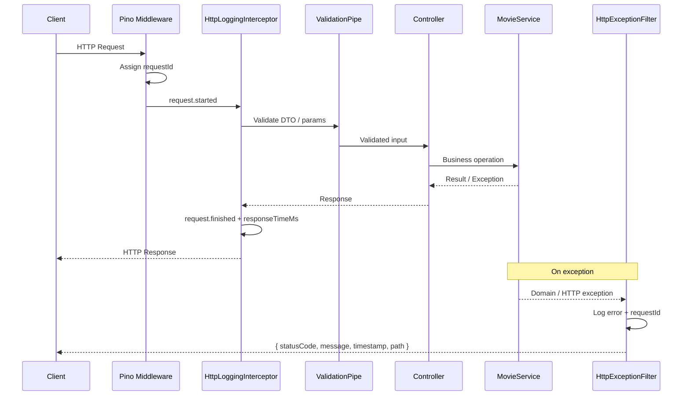
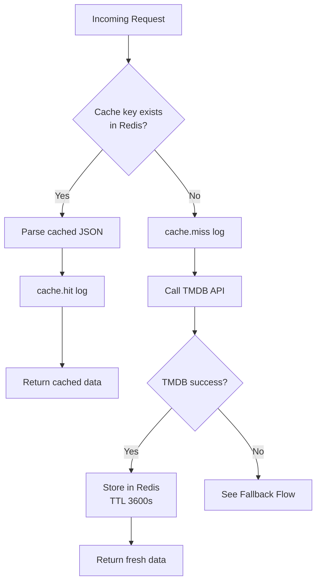
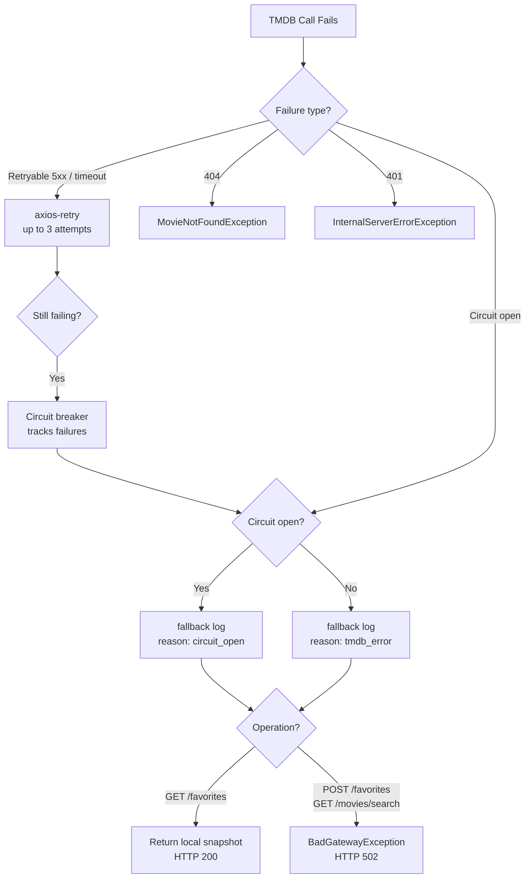

# Movie Favorites API

A production-oriented REST API for managing a personal movie watchlist. Users can search movies via [The Movie Database (TMDB)](https://www.themoviedb.org/), save favorites with local snapshots, mark films as watched, and assign personal ratings — with Redis caching, resilient TMDB integration, and structured logging.

---

## Table of Contents

- [Features](#features)
- [Architecture](#architecture)
- [Tech Stack](#tech-stack)
- [Project Structure](#project-structure)
- [Application Flow](#application-flow)
- [Getting Started with Docker Compose](#getting-started-with-docker-compose)
- [Local Development](#local-development)
- [Database Migrations](#database-migrations)
- [Running Tests](#running-tests)
- [Swagger Documentation](#swagger-documentation)
- [Architectural Decisions](#architectural-decisions)
- [Trade-offs](#trade-offs)
- [Future Improvements](#future-improvements)

---

## Features

- **Movie search** — Paginated TMDB search with Redis caching and favorite flag enrichment
- **Favorites management** — Add movies with TMDB snapshot persistence
- **Watch tracking** — Idempotent "mark as watched" endpoint
- **Personal ratings** — Rate watched movies (0–10, up to 2 decimal places)
- **Resilience** — Axios retry, circuit breaker (Opossum), and graceful TMDB fallback
- **Observability** — Structured JSON logs via Pino with `requestId` correlation
- **API documentation** — OpenAPI/Swagger UI

---

## Architecture

The application follows a **layered modular architecture** on NestJS:

| Layer | Responsibility |
|-------|----------------|
| **Controller** | HTTP routing, DTO validation, Swagger metadata |
| **Service** | Business rules and orchestration (`MovieService`) |
| **Repository** | Database persistence (`FavoriteRepository` + Prisma) |
| **Infrastructure** | External integrations (`TmdbService`, `RedisService`) |

Cross-cutting concerns (logging, exception handling, validation) live in `src/common/`.

### Architecture Diagram


---

## Tech Stack

| Category | Technology |
|----------|------------|
| Runtime | Node.js 22 |
| Framework | NestJS 11 |
| Language | TypeScript 5 |
| Database | PostgreSQL 16 + Prisma ORM |
| Cache | Redis 7 (ioredis) |
| External API | TMDB REST API (Axios) |
| Resilience | axios-retry, Opossum circuit breaker |
| Logging | Pino (nestjs-pino) |
| Validation | class-validator, class-transformer |
| Documentation | Swagger / OpenAPI |
| Testing | Jest, Supertest |
| Containerization | Docker, Docker Compose |

---

## Project Structure

```
movie-favorites-api/
├── prisma/
│   ├── schema.prisma          # Database schema
│   └── migrations/            # Versioned SQL migrations
├── src/
│   ├── main.ts                # Application bootstrap
│   ├── app.module.ts          # Root module
│   ├── common/                # Cross-cutting concerns
│   │   ├── exceptions/        # Domain exceptions
│   │   ├── filters/           # Global HTTP exception filter
│   │   ├── interceptors/      # Request logging interceptor
│   │   ├── logging/           # Pino configuration & log events
│   │   ├── pipes/             # Validation exception factory
│   │   └── swagger/           # Swagger setup
│   ├── config/                # Environment validation & config service
│   ├── modules/
│   │   ├── favorites/         # Favorite controller, repository, DTOs
│   │   ├── movies/            # Movie controller, service, mappers
│   │   └── health/            # Health check endpoint
│   ├── prisma/                # Prisma module & service
│   ├── redis/                 # Redis module & service
│   └── tmdb/                  # TMDB client, retry & circuit breaker
├── test/
│   ├── favorites.e2e-spec.ts  # Integration tests (Supertest)
│   ├── movies.e2e-spec.ts
│   └── helpers/               # Test app factory & fixtures
├── docker-compose.yml
├── Dockerfile
└── .env.example
```

---

## Application Flow

### Request Flow

Every HTTP request passes through the global pipeline before reaching a controller:



### Cache Flow

Redis is used as a read-through cache for TMDB responses. TTL is **1 hour** for both search results and favorite enrichment.



**Cache keys:**

| Purpose | Key pattern | TTL |
|---------|-------------|-----|
| Movie search | `movies:search:{query}:{page}` | 3600s |
| Favorite enrichment | `favorites:tmdb:{tmdbId}` | 3600s |

### Fallback Flow

When TMDB is unavailable, behavior depends on the operation:



---

## Getting Started with Docker Compose

### Prerequisites

- Docker & Docker Compose
- A [TMDB API key](https://www.themoviedb.org/settings/api)

### Steps

1. **Clone and configure environment**

   ```bash
   git clone <repository-url>
   cd movie-favorites-api
   cp .env.example .env
   ```

   Edit `.env` and set your `TMDB_API_KEY`.

2. **Start infrastructure services**

   ```bash
   docker compose up -d postgres redis
   ```

3. **Run database migrations**

   ```bash
   npm install
   npx prisma migrate deploy
   ```

4. **Start the full stack**

   ```bash
   docker compose up -d
   ```

5. **Verify the API is healthy**

   ```bash
   curl http://localhost:3000/health
   ```

The API will be available at `http://localhost:3000`.

### Docker Services

| Service | Container | Port |
|---------|-----------|------|
| API | `movie-favorites-api` | 3000 |
| PostgreSQL | `movie-favorites-postgres` | 5432 |
| Redis | `movie-favorites-redis` | 6379 |

---

## Local Development

Run the API on your machine while using Docker only for PostgreSQL and Redis:

```bash
# 1. Start dependencies
docker compose up -d postgres redis

# 2. Install dependencies
npm install

# 3. Configure environment
cp .env.example .env
# Ensure DATABASE_URL and REDIS_URL point to localhost

# 4. Apply migrations
npm run prisma:migrate

# 5. Start in watch mode
npm run start:dev
```

### Useful Scripts

| Command | Description |
|---------|-------------|
| `npm run start:dev` | Start with hot reload |
| `npm run build` | Compile for production |
| `npm run start:prod` | Run compiled build |
| `npm run lint` | ESLint with auto-fix |
| `npm run format` | Prettier formatting |
| `npm run prisma:studio` | Open Prisma Studio GUI |

---

## Database Migrations

Migrations are managed with [Prisma Migrate](https://www.prisma.io/docs/concepts/components/prisma-migrate).

### Development (creates migration files)

```bash
npm run prisma:migrate
# equivalent to: npx prisma migrate dev
```

### Production / CI (applies existing migrations)

```bash
npx prisma migrate deploy
```

### Regenerate Prisma Client

```bash
npm run prisma:generate
```

> **Note:** The production Docker image does not include the Prisma CLI. Run `migrate deploy` from the host (or a CI job) before starting the API container.

---

## Running Tests

### Unit Tests

Tests business logic in isolation with mocked dependencies:

```bash
npm test
```

### Integration Tests (Supertest)

Tests the full HTTP pipeline (controllers, pipes, filters) with mocked infrastructure:

```bash
npm run test:e2e
```

### Coverage

```bash
npm run test:cov
```

| Type | Location | What it validates |
|------|----------|-------------------|
| Unit | `src/**/*.spec.ts` | Service methods, mappers, retry/circuit breaker |
| Integration | `test/*.e2e-spec.ts` | HTTP status, response body, error format |

---

## Swagger Documentation

Interactive API documentation is available when the application is running:

| Resource | URL |
|----------|-----|
| Swagger UI | [http://localhost:3000/docs](http://localhost:3000/docs) |
| OpenAPI JSON | [http://localhost:3000/docs-json](http://localhost:3000/docs-json) |

### API Endpoints

| Method | Path | Description |
|--------|------|-------------|
| `GET` | `/health` | Health check |
| `GET` | `/movies/search` | Search movies on TMDB |
| `GET` | `/favorites` | List favorites (TMDB-enriched) |
| `POST` | `/favorites` | Add a movie to favorites |
| `PATCH` | `/favorites/:tmdbId/watch` | Mark as watched |
| `PATCH` | `/favorites/:tmdbId/rating` | Rate a watched movie |

### Error Response Format

All errors follow a consistent structure:

```json
{
  "statusCode": 404,
  "message": "Favorite with TMDB id 999 not found",
  "timestamp": "2026-07-04T15:00:00.000Z",
  "path": "/favorites/999/watch"
}
```

---

## Architectural Decisions

### Thin controllers, fat service

Controllers delegate all business logic to `MovieService`. This keeps HTTP concerns separate from domain rules and simplifies unit testing.

### Local snapshots instead of TMDB as source of truth

Favorites store a snapshot (title, overview, poster, vote average) at the time of favoriting. TMDB is used for **enrichment** on read, not as the primary data store. This ensures favorites remain usable even when TMDB data changes or becomes unavailable.

### Single service for movies and favorites

`MovieService` handles both search and favorites operations because they share TMDB integration, caching, and enrichment logic. Modules remain separate at the controller/repository level.

### Graceful degradation on read, fail-fast on write

- `GET /favorites` returns local data when TMDB fails (HTTP 200)
- `POST /favorites` and `GET /movies/search` return HTTP 502 when TMDB is unreachable

This reflects the user expectation: reading stale data is acceptable; creating incomplete records is not.

### Structured logging with request correlation

Pino replaces `console.log`. Every log within an HTTP request includes a `requestId` (from `x-request-id` header or auto-generated UUID), enabling end-to-end traceability in production log aggregators.

### Domain exceptions over generic errors

Business errors (`MovieAlreadyFavoritedException`, `MovieNotFoundException`, etc.) map to specific HTTP status codes via a global exception filter, keeping error handling consistent across the API.

---

## Trade-offs

| Decision | Benefit | Cost |
|----------|---------|------|
| **TMDB snapshots** | Resilient reads, no data loss on TMDB outage | Stale metadata until next cache refresh |
| **Redis cache (1h TTL)** | Reduced TMDB API calls, faster responses | Possible stale search/enrichment data |
| **Circuit breaker** | Prevents cascade failures under TMDB stress | Temporary 502 on writes while circuit is open |
| **Single `MovieService`** | Shared caching/TMDB logic, less duplication | Service grows with new features; may need splitting later |
| **No authentication** | Simpler API, faster development | Not suitable for multi-user production without adding auth |
| **Prisma Migrate (manual in Docker)** | Explicit, auditable schema changes | Requires a migration step outside the container startup |
| **Parallel TMDB enrichment** | Fast `GET /favorites` with many items | Higher burst load on TMDB when cache is cold |

---

## Future Improvements

- **Authentication & authorization** — JWT or OAuth2 for multi-user support (Swagger already reserves Bearer auth)
- **Automated migrations in Docker** — Entrypoint script running `prisma migrate deploy` on container start
- **Rate limiting** — Protect TMDB quota and prevent abuse (`@nestjs/throttler`)
- **Pagination on favorites** — `GET /favorites` currently returns all records
- **Cache invalidation strategy** — Event-driven invalidation when favorites change
- **Metrics & tracing** — Prometheus metrics and OpenTelemetry distributed tracing
- **CI/CD pipeline** — GitHub Actions for lint, test, build, and deploy
- **API versioning** — `/v1/` prefix for backward-compatible evolution
- **Soft delete** — Allow removing favorites without permanent deletion
- **Webhook / event bus** — Notify external systems on favorite changes

---

## Environment Variables

See [`.env.example`](.env.example) for the full list. Required variables:

| Variable | Description |
|----------|-------------|
| `APP_PORT` | HTTP port (default: `3000`) |
| `DATABASE_URL` | PostgreSQL connection string |
| `REDIS_URL` | Redis connection string |
| `TMDB_API_KEY` | TMDB API key |
| `TMDB_BASE_URL` | TMDB API base URL (default: `https://api.themoviedb.org/3`) |

---

## License

UNLICENSED — Private project.
