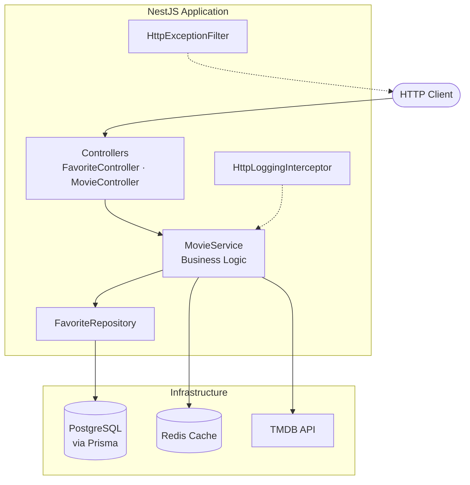

# Movie Favorites API

API REST para gerenciar filmes favoritos. Busca no [TMDB](https://www.themoviedb.org/), persiste snapshots locais, marca assistidos e registra notas. Redis para cache, retry + circuit breaker na integração com o TMDB, logs JSON via Pino.

## 🚀 Início Rápido

```bash
git clone https://github.com/ConstantinoRafael/movie-favorites-api.git
cd movie-favorites-api
cp .env.example .env
```

Coloque sua `TMDB_API_KEY` no `.env` ([pegar chave](https://www.themoviedb.org/settings/api)).

```bash
docker compose up -d
npm install && npx prisma migrate deploy
```

- **Swagger:** [http://localhost:3000/docs](http://localhost:3000/docs)
- **Health Check:** [http://localhost:3000/health](http://localhost:3000/health)

## ✅ Requisitos Atendidos

| Requisito | Status |
|-----------|--------|
| Busca de filmes | ✅ |
| Favoritos | ✅ |
| Listagem de favoritos | ✅ |
| Marcar como assistido | ✅ |
| Avaliação | ✅ |
| Validação de nota | ✅ |
| Validação de duplicidade | ✅ |
| Cache Redis | ✅ |
| Retry | ✅ |
| Circuit Breaker | ✅ |
| Docker Compose | ✅ |
| Swagger | ✅ |
| Testes Unitários | ✅ |
| Testes de Integração | ✅ |
| Logs Estruturados | ✅ |
| Fallback quando o TMDB estiver indisponível | ✅ |

## ⭐ Diferenciais Implementados

- **Redis Cache** — Cache read-through das respostas do TMDB (TTL 1h). Menos latência, menos chamadas externas.
- **Retry** — Erros 5xx e timeout: até 3 tentativas com `axios-retry` antes de estourar o erro.
- **Circuit Breaker** — Opossum abre o circuito quando o TMDB acumula falhas, evitando ficar batendo em serviço morto.
- **Logs Estruturados** — Pino em JSON, pronto para mandar pro Datadog/CloudWatch/etc.
- **Correlation ID** — `requestId` em toda requisição (`x-request-id` ou UUID gerado), propagado nos logs.
- **Swagger** — Docs geradas dos decorators, em `/docs` com a app rodando.
- **Testes** — Unitários (services, mappers, retry/circuit breaker) + integração HTTP com Supertest.
- **Docker** — API, PostgreSQL e Redis sobem com `docker compose up`.
- **Graceful Degradation** — `GET /favorites` responde 200 com snapshot local se o TMDB cair; writes retornam 502.

---

## Índice

- [Início Rápido](#-início-rápido)
- [Requisitos Atendidos](#-requisitos-atendidos)
- [Diferenciais Implementados](#-diferenciais-implementados)
- [Funcionalidades](#funcionalidades)
- [Arquitetura](#arquitetura)
- [Stack Tecnológica](#stack-tecnológica)
- [Por que NestJS?](#por-que-nestjs)
- [Estrutura do Projeto](#estrutura-do-projeto)
- [Modelo de Dados](#modelo-de-dados)
- [Regras de Negócio Implementadas](#regras-de-negócio-implementadas)
- [Cache e Resiliência](#cache-e-resiliência)
- [Primeiros Passos com Docker Compose](#primeiros-passos-com-docker-compose)
- [Desenvolvimento Local](#desenvolvimento-local)
- [Migrations do Banco de Dados](#migrations-do-banco-de-dados)
- [Executando os Testes](#executando-os-testes)
- [Documentação Swagger](#documentação-swagger)
- [Exemplos de Utilização da API](#exemplos-de-utilização-da-api)
- [Decisões Arquiteturais](#decisões-arquiteturais)
- [Trade-offs](#trade-offs)
- [Melhorias Futuras](#melhorias-futuras)

---

## Funcionalidades

- **Busca de filmes** — Paginação no TMDB, cache Redis, flag de favorito na resposta
- **Favoritos** — Cadastro com snapshot persistido do TMDB
- **Assistidos** — Endpoint idempotente para marcar como assistido
- **Notas** — Avaliação de 0 a 10 (até 2 casas decimais)
- **Resiliência** — Retry (Axios), circuit breaker (Opossum), fallback no TMDB
- **Observabilidade** — Logs JSON (Pino) com `requestId`
- **Docs** — OpenAPI/Swagger UI

---

## Arquitetura

Camadas modulares no NestJS:

| Camada | Responsabilidade |
|-------|----------------|
| **Controller** | Rotas HTTP, validação de DTOs, metadados Swagger |
| **Service** | Regras de negócio e orquestração (`MovieService`) |
| **Repository** | Persistência (`FavoriteRepository` + Prisma) |
| **Infraestrutura** | Integrações externas (`TmdbService`, `RedisService`) |

Logging, exceções e validação global ficam em `src/common/`.

### Diagrama de Arquitetura



---

## Stack Tecnológica

| Categoria | Tecnologia |
|----------|------------|
| Runtime | Node.js 22 |
| Framework | NestJS 11 |
| Linguagem | TypeScript 5 |
| Banco de dados | PostgreSQL 16 + Prisma ORM |
| Cache | Redis 7 (ioredis) |
| API externa | TMDB REST API (Axios) |
| Resiliência | axios-retry, Opossum circuit breaker |
| Logging | Pino (nestjs-pino) |
| Validação | class-validator, class-transformer |
| Documentação | Swagger / OpenAPI |
| Testes | Jest, Supertest |
| Containerização | Docker, Docker Compose |

## Por que NestJS?

O projeto tem vários pedaços distintos — busca, favoritos, cache, TMDB, resiliência — e o NestJS organiza isso em módulos (`movies`, `favorites`, `tmdb`, `redis`) sem virar pasta solta com imports cruzados. Cada módulo encapsula o que é dele.

A injeção de dependência deixa o fluxo explícito: controller → service → repository/cliente externo. Na prática, isso facilita mockar dependência no teste e manter camadas separadas. Controllers cuidam de HTTP; services concentram a regra de negócio.

Para testes, o `TestingModule` monta o grafo de DI com mocks onde precisar — usei isso nos unitários de service/mapper/resiliência e nos e2e com Supertest. Swagger via decorators mantém contrato e código no mesmo lugar, sem doc desatualizada.

O escopo hoje é pequeno, mas o mesmo layout aguenta auth, rate limit ou fila sem reescrever tudo. TypeScript + pipes de validação + filters globais já vêm no pacote. Foi a escolha mais pragmática pra entregar algo organizado rápido, sem abrir mão de estrutura.

---

## Estrutura do Projeto

```
movie-favorites-api/
├── prisma/
│   ├── schema.prisma          # Schema do banco de dados
│   └── migrations/            # Migrations SQL versionadas
├── src/
│   ├── main.ts                # Bootstrap da aplicação
│   ├── app.module.ts          # Módulo raiz
│   ├── common/                # Cross-cutting (logs, filters, pipes)
│   │   ├── exceptions/        # Exceções de domínio
│   │   ├── filters/           # Filtro global de exceções HTTP
│   │   ├── interceptors/      # Interceptor de logging de requisições
│   │   ├── logging/           # Configuração Pino e eventos de log
│   │   ├── pipes/             # Factory de exceções de validação
│   │   └── swagger/           # Configuração Swagger
│   ├── config/                # Validação de ambiente e config service
│   ├── modules/
│   │   ├── favorites/         # Controller, repository e DTOs de favoritos
│   │   ├── movies/            # Controller, service e mappers de filmes
│   │   └── health/            # Endpoint de health check
│   ├── prisma/                # Módulo e service Prisma
│   ├── redis/                 # Módulo e service Redis
│   └── tmdb/                  # Cliente TMDB, retry e circuit breaker
├── test/
│   ├── favorites.e2e-spec.ts  # Testes de integração (Supertest)
│   ├── movies.e2e-spec.ts
│   └── helpers/               # Factory de app de teste e fixtures
├── docker-compose.yml
├── Dockerfile
└── .env.example
```

## Modelo de Dados

**Favorite** é um filme salvo na lista do usuário. A chave de negócio é o `tmdbId`; o resto divide-se em estado local (`watched`, `rating`) e metadados do filme gravados no cadastro.

`title`, `releaseYear`, `overview` e `posterPath` vão pro banco como **snapshot** — cópia do que o TMDB devolveu na hora do favoritar. Se o TMDB cair depois, a listagem ainda funciona com esses dados; enriquecimento em tempo real é tentado quando dá.

| Campo | Tipo | Descrição |
|-------|------|-----------|
| `id` | `Int` | PK interna |
| `tmdbId` | `Int` | ID no TMDB (unique) |
| `title` | `String` | Título (snapshot) |
| `releaseYear` | `Int` | Ano de lançamento (snapshot) |
| `overview` | `Text` | Sinopse (snapshot) |
| `posterPath` | `String?` | Poster no TMDB (snapshot) |
| `watched` | `Boolean` | Filme assistido? |
| `watchedAt` | `DateTime?` | Quando marcou como assistido |
| `rating` | `Float?` | Nota pessoal (0–10) |
| `createdAt` | `DateTime` | Criação do registro |
| `updatedAt` | `DateTime` | Última atualização |

## Regras de Negócio Implementadas

| Regra | Comportamento da API |
|-------|----------------------|
| Não permitir favoritos duplicados | `409 Conflict` se o `tmdbId` já existir |
| Nota entre 0 e 10 | DTO valida intervalo e até 2 decimais → `400 Bad Request` |
| Só avaliar após assistir | `400 Bad Request` com `watched: false` |
| Snapshot local | Metadados do TMDB gravados no PostgreSQL no `POST /favorites`; usados quando enriquecimento falha |
| Fallback do TMDB | `GET /favorites` → `200` com dados locais; `POST /favorites` e `GET /movies/search` → `502` sem TMDB |

---

## Cache e Resiliência

### Cache

Respostas do TMDB passam por cache **read-through** no Redis (TTL **1 hora**):

- **Cache hit** — a chave existe no Redis; a API devolve o JSON cacheado sem chamar o TMDB.
- **Cache miss** — a API consulta o TMDB, grava o resultado no Redis e responde ao cliente.

| Propósito | Chave | TTL |
|-----------|-------|-----|
| Busca de filmes | `movies:search:{query}:{page}` | 3600s |
| Enriquecimento de favoritos | `favorites:tmdb:{tmdbId}` | 3600s |

### Resiliência e Fallback

Chamadas ao TMDB usam **retry** (`axios-retry`, até 3 tentativas em 5xx/timeout) e **circuit breaker** (Opossum) para não insistir em serviço degradado.

Quando o TMDB falha, o comportamento depende da operação (**graceful degradation**):

- **`GET /favorites`** — retorna `200 OK` com snapshot local do PostgreSQL; log `fallback` (`tmdb_unavailable` ou `circuit_open`).
- **`POST /favorites`** e **`GET /movies/search`** — retornam `502 Bad Gateway`, pois dependem de dado fresco do TMDB.

Erros mapeados: `404` → filme não encontrado; `401` na API key → erro interno.

---

## Primeiros Passos com Docker Compose

### Pré-requisitos

- Docker & Docker Compose
- [Chave de API do TMDB](https://www.themoviedb.org/settings/api)

### Passos

1. **Clone e `.env`**

   ```bash
   git clone <repository-url>
   cd movie-favorites-api
   cp .env.example .env
   ```

   Preencha `TMDB_API_KEY` no `.env`.

2. **Sobe postgres e redis**

   ```bash
   docker compose up -d postgres redis
   ```

3. **Roda migrations**

   ```bash
   npm install
   npx prisma migrate deploy
   ```

4. **Sobe tudo**

   ```bash
   docker compose up -d
   ```

5. **Confere health**

   ```bash
   curl http://localhost:3000/health
   ```

API em `http://localhost:3000`.

### Serviços Docker

| Serviço | Container | Porta |
|---------|-----------|------|
| API | `movie-favorites-api` | 3000 |
| PostgreSQL | `movie-favorites-postgres` | 5432 |
| Redis | `movie-favorites-redis` | 6379 |

---

## Desenvolvimento Local

API na máquina local; Docker só pro PostgreSQL e Redis:

```bash
# 1. Start dependencies
docker compose up -d postgres redis

# 2. Install dependencies
npm install

# 3. Configure environment
cp .env.example .env
# Ensure DATABASE_URL and REDIS_URL point to localhost

# 4. Apply migrations
npm run prisma:migrate

# 5. Start in watch mode
npm run start:dev
```

### Scripts Úteis

| Comando | Descrição |
|---------|-------------|
| `npm run start:dev` | Dev com hot reload |
| `npm run build` | Build de produção |
| `npm run start:prod` | Roda o build |
| `npm run lint` | ESLint + fix |
| `npm run format` | Prettier |
| `npm run prisma:studio` | Prisma Studio |

---

## Migrations do Banco de Dados

Gerenciadas com [Prisma Migrate](https://www.prisma.io/docs/concepts/components/prisma-migrate).

### Desenvolvimento (cria arquivos de migration)

```bash
npm run prisma:migrate
# equivalent to: npx prisma migrate dev
```

### Produção / CI (aplica migrations existentes)

```bash
npx prisma migrate deploy
```

### Regenerar o Prisma Client

```bash
npm run prisma:generate
```

> **Nota:** A imagem Docker de produção não traz Prisma CLI. Rode `migrate deploy` no host ou no CI antes de subir o container da API.

---

## Executando os Testes

### Testes Unitários

Lógica isolada, dependências mockadas:

```bash
npm test
```

### Testes de Integração (Supertest)

Pipeline HTTP completo (controllers, pipes, filters), infra mockada:

```bash
npm run test:e2e
```

### Cobertura

```bash
npm run test:cov
```

| Tipo | Localização | O que valida |
|------|----------|-------------------|
| Unitário | `src/**/*.spec.ts` | Services, mappers, retry/circuit breaker |
| Integração | `test/*.e2e-spec.ts` | Status HTTP, body, formato de erro |

---

## Documentação Swagger

Com a app rodando:

| Recurso | URL |
|----------|-----|
| Swagger UI | [http://localhost:3000/docs](http://localhost:3000/docs) |
| OpenAPI JSON | [http://localhost:3000/docs-json](http://localhost:3000/docs-json) |

### Endpoints da API

| Método | Caminho | Descrição |
|--------|------|-------------|
| `GET` | `/health` | Health check |
| `GET` | `/movies/search` | Buscar filmes no TMDB |
| `GET` | `/favorites` | Listar favoritos (enriquecidos pelo TMDB) |
| `POST` | `/favorites` | Adicionar filme aos favoritos |
| `PATCH` | `/favorites/:tmdbId/watch` | Marcar como assistido |
| `PATCH` | `/favorites/:tmdbId/rating` | Avaliar filme assistido |

### Formato de Resposta de Erro

Erros seguem sempre este shape:

```json
{
  "statusCode": 404,
  "message": "Favorite with TMDB id 999 not found",
  "timestamp": "2026-07-04T15:00:00.000Z",
  "path": "/favorites/999/watch"
}
```

---

## Exemplos de Utilização da API

Espaço reservado para prints do Postman nas operações principais.

### Buscar filmes

`GET /movies/search?query=fight+club&page=1`

<!-- Inserir print do Postman aqui -->

Busca paginada no TMDB: parâmetros `query`/`page`, `200 OK`, lista com flag de favorito por filme.

### Favoritar filme

`POST /favorites`

```json
{ "tmdbId": 550 }
```

<!-- Inserir print do Postman aqui -->

Cadastro via `tmdbId`: body da request, `201 Created`, resposta com snapshot (título, sinopse, poster…).

### Listar favoritos

`GET /favorites`

<!-- Inserir print do Postman aqui -->

Lista enriquecida pelo TMDB: `200 OK`, array com campos locais (`watched`, `rating`) + metadados.

### Marcar como assistido

`PATCH /favorites/550/watch`

<!-- Inserir print do Postman aqui -->

Idempotente: `tmdbId` na URL, `200 OK`, `watched: true` e `watchedAt` preenchido.

### Avaliar filme

`PATCH /favorites/550/rating`

```json
{ "rating": 8.5 }
```

<!-- Inserir print do Postman aqui -->

Nota entre 0–10 no body, `200 OK`, favorito atualizado com `rating`.

### Funcionamento do Cache

`GET /movies/search?query=fight+club&page=1` *(mesma request repetida)*

**Primeira requisição**

<!-- Inserir print do Postman aqui — primeira requisição -->

Cache miss: vai no TMDB, grava no Redis, responde. Tempo de resposta maior — chamada HTTP externa.

**Segunda requisição**

<!-- Inserir print do Postman aqui — segunda requisição -->

Cache hit: lê do Redis, TMDB nem é chamado. Tempo bem menor na mesma busca.

Primeira vez: sem chave no Redis → TMDB → grava JSON (TTL 1h) → responde. Repetindo os mesmos params, sai direto do Redis — menos latência e menos uso da cota TMDB.

### Fallback quando o TMDB está indisponível

TMDB fora ou circuit breaker aberto:

- **`GET /favorites`** — `200 OK` com snapshot do PostgreSQL, sem depender de enriquecimento.
- **`POST /favorites`** e **`GET /movies/search`** — `502 Bad Gateway` (precisam de dado fresco do TMDB).

`GET /favorites` *(TMDB indisponível)*

<!-- Inserir print da resposta -->

Listagem respondendo `200 OK` com metadados locais (`title`, `overview`, `posterPath`…) — TMDB fora do ar.

<!-- Inserir print dos logs -->

Log `fallback` com `reason: tmdb_unavailable` ou `reason: circuit_open` — API caiu pro dado local em vez de quebrar a request.

Esse é o requisito central do fallback: listar favoritos continua funcionando com o que foi persistido no cadastro, mesmo sem TMDB.

---

## Decisões Arquiteturais

### Controllers finos, service robusto

Controllers só roteiam e validam; regra de negócio fica no `MovieService`. Separa HTTP de domínio e deixa unit test mais simples.

### Snapshot local, TMDB só enriquece

No favoritar, grava título/sinopse/poster/nota TMDB no banco. Na leitura, tenta atualizar via TMDB, mas o dado local manda se a API externa falhar ou mudar.

### Um service pra filmes e favoritos

`MovieService` concentra busca e favoritos porque compartilham TMDB, cache e enriquecimento. Módulos separados no controller/repository.

### Degrada na leitura, falha na escrita

- `GET /favorites` → 200 com dado local se TMDB cair
- `POST /favorites` / `GET /movies/search` → 502 sem TMDB

Ler dado velho é ok; criar favorito ou buscar sem TMDB não.

### Logs com requestId

Pino no lugar de `console.log`. Todo log da request carrega `requestId` (`x-request-id` ou UUID) — dá pra seguir o fluxo no agregador.

### Exceções de domínio

`MovieAlreadyFavoritedException`, `MovieNotFoundException`, etc. mapeiam pra status HTTP no filter global. Erro consistente em toda a API.

---

## Trade-offs

| Decisão | Benefício | Custo |
|----------|---------|------|
| **Snapshots do TMDB** | Leitura funciona com TMDB fora | Metadados podem ficar desatualizados até o cache renovar |
| **Cache Redis (TTL 1h)** | Menos hit no TMDB, resposta mais rápida | Busca/enriquecimento podem servir dado velho |
| **Circuit breaker** | Para de martelar TMDB degradado | 502 em writes enquanto circuito aberto |
| **Service único `MovieService`** | Cache/TMDB num lugar só | Service cresce; pode precisar split depois |
| **Sem autenticação** | Menos complexidade no escopo atual | Multi-usuário exige auth |
| **Prisma Migrate manual no Docker** | Schema explícito e auditável | Migration roda fora do startup do container |
| **Enriquecimento TMDB em paralelo** | `GET /favorites` rápido com muitos itens | Burst no TMDB quando cache frio |

---

## Melhorias Futuras

- **Auth** — JWT/OAuth2 multi-usuário (Swagger já tem slot Bearer)
- **Migrations no Docker** — Entrypoint com `prisma migrate deploy`
- **Rate limiting** — Proteger cota TMDB (`@nestjs/throttler`)
- **Paginação em favoritos** — Hoje `GET /favorites` traz tudo
- **Invalidação de cache** — Invalidar quando favorito muda
- **Métricas/tracing** — Prometheus + OpenTelemetry
- **CI/CD** — GitHub Actions (lint, test, build, deploy)
- **Versionamento** — Prefixo `/v1/`
- **Soft delete** — Remover favorito sem apagar de vez
- **Webhook/event bus** — Notificar mudanças em favoritos

---

## Variáveis de Ambiente

Lista completa no [`.env.example`](.env.example). Obrigatórias:

| Variável | Descrição |
|----------|-------------|
| `APP_PORT` | Porta HTTP (default: `3000`) |
| `DATABASE_URL` | Connection string PostgreSQL |
| `REDIS_URL` | Connection string Redis |
| `TMDB_API_KEY` | Chave TMDB |
| `TMDB_BASE_URL` | Base URL TMDB (default: `https://api.themoviedb.org/3`) |

---

## Licença

UNLICENSED — Projeto privado.
