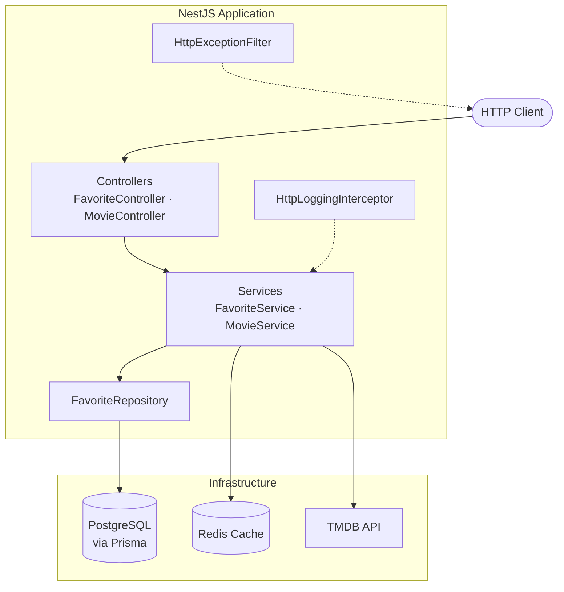
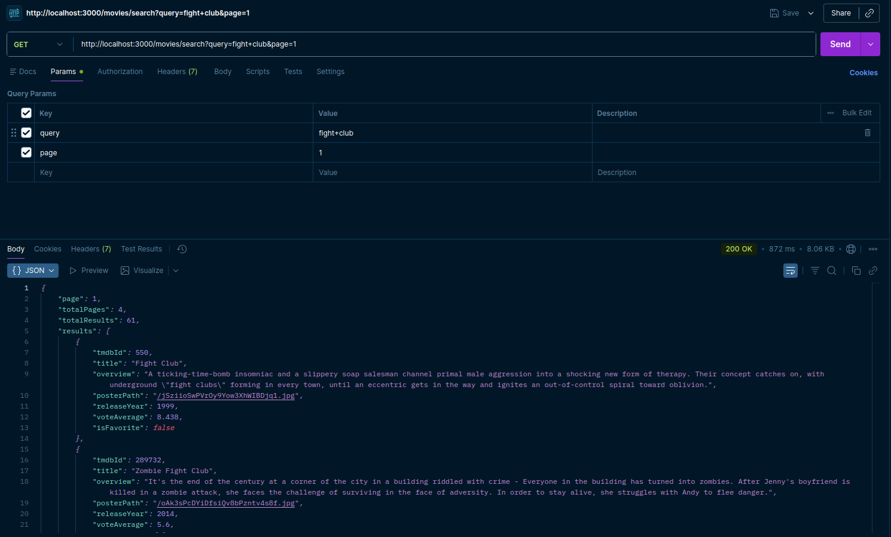
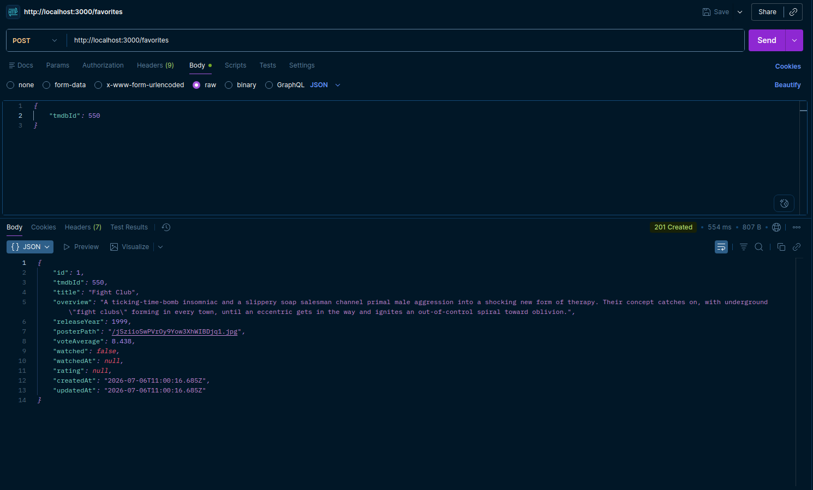
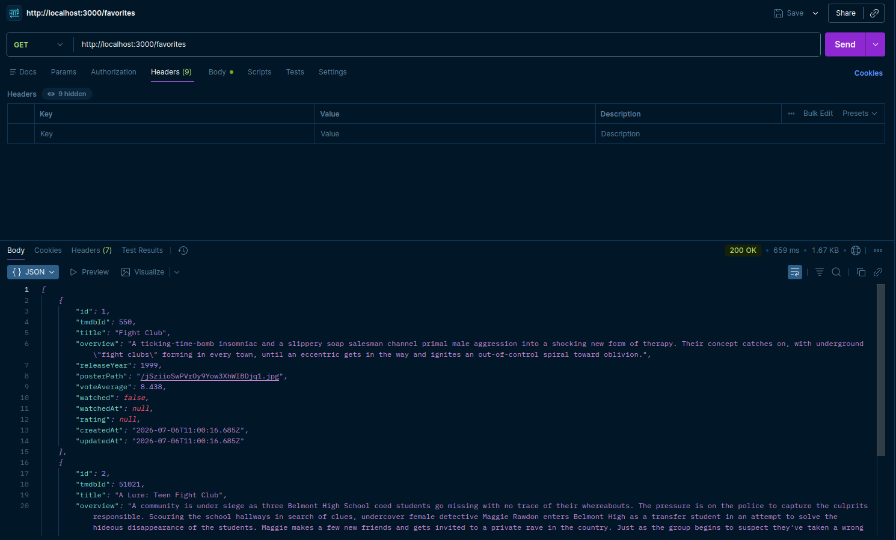
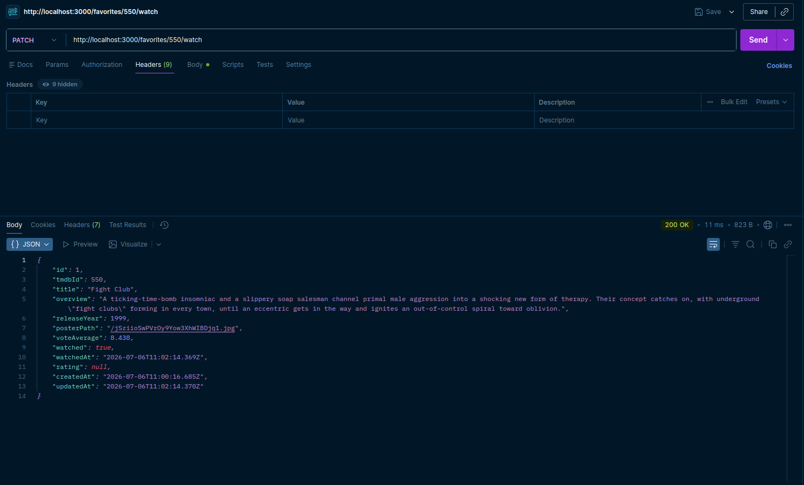
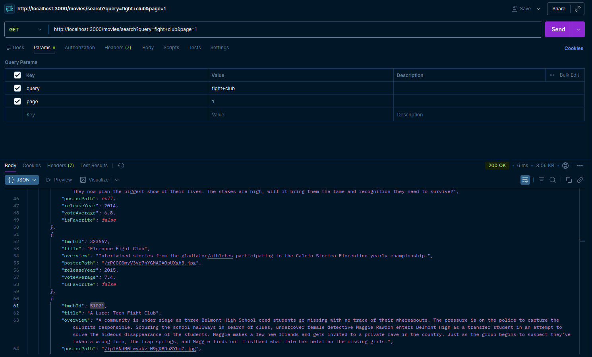
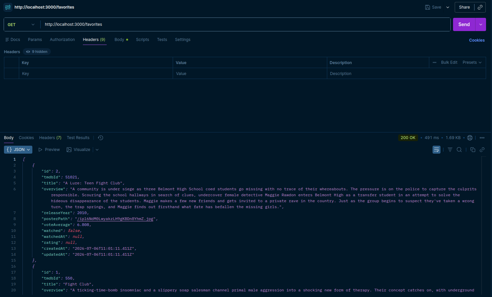
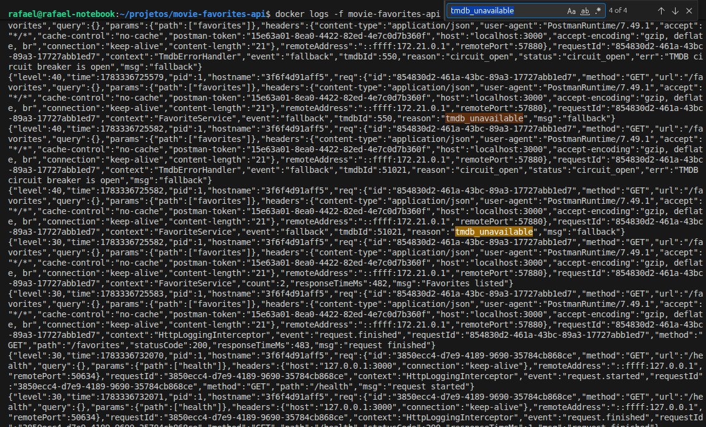
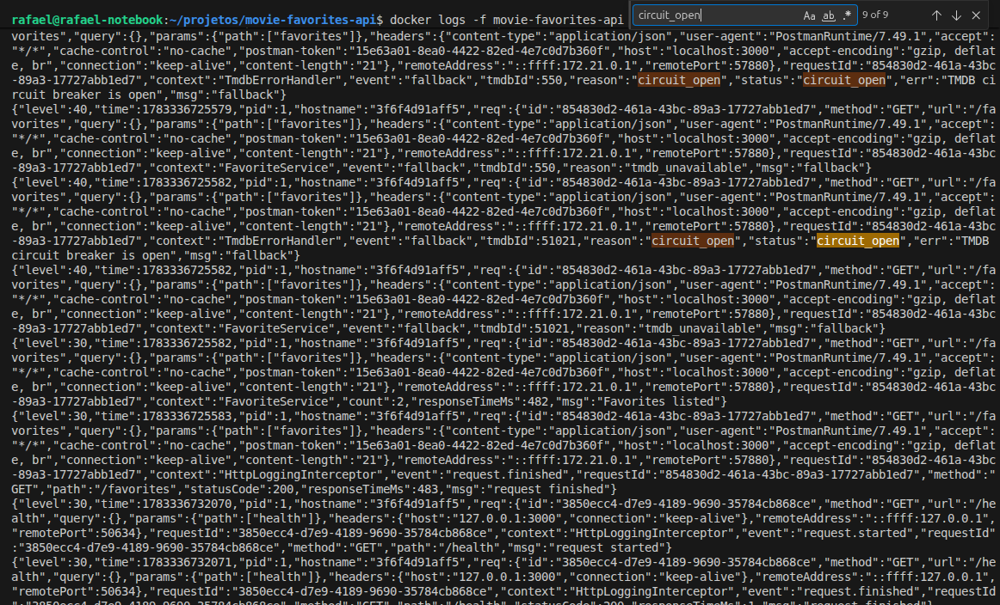

# Movie Favorites API

API REST para gerenciar filmes favoritos. Busca no [TMDB](https://www.themoviedb.org/), persiste snapshots locais, marca assistidos e registra notas. Redis para cache, retry + circuit breaker na integração com o TMDB, logs JSON via Pino.

## 🚀 Início Rápido

**Pré-requisitos:** Docker Compose e [chave de API do TMDB](https://www.themoviedb.org/settings/api).

```bash
git clone https://github.com/ConstantinoRafael/movie-favorites-api.git
cd movie-favorites-api
cp .env.example .env
```

Coloque sua `TMDB_API_KEY` no `.env`.

```bash
docker compose up -d
npm install && npx prisma migrate deploy
```

| Recurso | URL |
|---------|-----|
| Swagger | [http://localhost:3000/docs](http://localhost:3000/docs) |
| Health check | [http://localhost:3000/health](http://localhost:3000/health) |

**Serviços Docker:**

| Serviço | Container | Porta |
|---------|-----------|------|
| API | `movie-favorites-api` | 3000 |
| PostgreSQL | `movie-favorites-postgres` | 5432 |
| Redis | `movie-favorites-redis` | 6379 |

> Para rodar a API na máquina local (sem container da app), veja [Desenvolvimento Local](#desenvolvimento-local).

## ✅ Requisitos Atendidos

Checklist do desafio técnico:

| Requisito | Status |
|-----------|--------|
| Busca de filmes | ✅ |
| Favoritos | ✅ |
| Listagem de favoritos | ✅ |
| Marcar como assistido | ✅ |
| Avaliação | ✅ |
| Validação de nota | ✅ |
| Validação de duplicidade | ✅ |
| Cache Redis | ✅ |
| Retry | ✅ |
| Circuit Breaker | ✅ |
| Docker Compose | ✅ |
| Swagger | ✅ |
| Testes Unitários | ✅ |
| Testes de Integração | ✅ |
| Logs Estruturados | ✅ |
| Fallback quando o TMDB estiver indisponível | ✅ |

## ⭐ Diferenciais Implementados

- **Cache e resiliência TMDB** — Redis, retry, circuit breaker e graceful degradation ([detalhes](#cache-e-resiliência))
- **Logs estruturados** — Pino em JSON com `requestId` para correlação
- **Swagger / OpenAPI** — Contratos documentados em `/docs`
- **Testes** — Unitários + integração HTTP (Supertest)
- **Docker Compose** — API, PostgreSQL e Redis containerizados

---

## Índice

- [Início Rápido](#-início-rápido)
- [Requisitos Atendidos](#-requisitos-atendidos)
- [Diferenciais Implementados](#-diferenciais-implementados)
- [Funcionalidades](#funcionalidades)
- [Arquitetura](#arquitetura)
- [Stack Tecnológica](#stack-tecnológica)
- [Por que NestJS?](#por-que-nestjs)
- [Estrutura do Projeto](#estrutura-do-projeto)
- [Modelo de Dados](#modelo-de-dados)
- [Regras de Negócio Implementadas](#regras-de-negócio-implementadas)
- [Cache e Resiliência](#cache-e-resiliência)
- [Desenvolvimento Local](#desenvolvimento-local)
- [Migrations do Banco de Dados](#migrations-do-banco-de-dados)
- [Executando os Testes](#executando-os-testes)
- [Documentação Swagger](#documentação-swagger)
- [Exemplos de Utilização da API](#exemplos-de-utilização-da-api)
- [Decisões Arquiteturais](#decisões-arquiteturais)
- [Trade-offs](#trade-offs)
- [Melhorias Futuras](#melhorias-futuras)
- [Variáveis de Ambiente](#variáveis-de-ambiente)

---

## Funcionalidades

O que a API permite fazer:

- **Buscar filmes** — Pesquisa paginada no TMDB, com indicação de quais títulos já estão favoritados
- **Gerenciar favoritos** — Incluir filmes na lista; metadados do TMDB são salvos no cadastro
- **Acompanhar assistidos** — Marcar (e remarcar) filmes como assistidos de forma idempotente
- **Avaliar filmes** — Atribuir nota pessoal de 0 a 10, com até 2 casas decimais, após marcar como assistido

---

## Arquitetura

Camadas modulares no NestJS:

| Camada | Responsabilidade |
|-------|----------------|
| **Controller** | Rotas HTTP, validação de DTOs, metadados Swagger |
| **Service** | Regras de negócio (`MovieService`, `FavoriteService`) |
| **Repository** | Persistência (`FavoriteRepository` + Prisma) |
| **Infraestrutura** | Integrações externas (`TmdbService`, `RedisService`) |

Logging, exceções e validação global ficam em `src/common/`.

### Diagrama de Arquitetura



---

## Stack Tecnológica

| Categoria | Tecnologia |
|----------|------------|
| Runtime | Node.js 22 |
| Framework | NestJS 11 |
| Linguagem | TypeScript 5 |
| Banco de dados | PostgreSQL 16 + Prisma ORM |
| Cache | Redis 7 (ioredis) |
| API externa | TMDB REST API (Axios) |
| Resiliência | axios-retry, Opossum circuit breaker |
| Logging | Pino (nestjs-pino) |
| Validação | class-validator, class-transformer |
| Documentação | Swagger / OpenAPI |
| Testes | Jest, Supertest |
| Containerização | Docker, Docker Compose |

## Por que NestJS?

O projeto envolve busca, favoritos, cache, integração externa e resiliência — domínios distintos que precisam conviver sem virar um monólito de arquivos soltos. O NestJS organiza isso em módulos (`movies`, `favorites`, `tmdb`, `redis`) com fronteiras claras.

A injeção de dependência torna explícita a cadeia controller → service → repository/cliente externo, padrão familiar em backends TypeScript e fácil de estender. TypeScript, pipes de validação e filters globais já vêm integrados — menos boilerplate para entregar algo estruturado no prazo de um desafio.

O layout também escala: auth, rate limiting ou filas entram como novos módulos no mesmo modelo, sem reescrever a base.

---

## Estrutura do Projeto

```
movie-favorites-api/
├── prisma/
│   ├── schema.prisma          # Schema do banco de dados
│   └── migrations/            # Migrations SQL versionadas
├── src/
│   ├── main.ts                # Inicialização da aplicação
│   ├── app.module.ts          # Módulo raiz
│   ├── common/                # Transversal (logs, filters, pipes)
│   │   ├── exceptions/        # Exceções de domínio
│   │   ├── filters/           # Filtro global de exceções HTTP
│   │   ├── interceptors/      # Interceptor de logging de requisições
│   │   ├── logging/           # Configuração Pino e eventos de log
│   │   ├── pipes/             # Factory de exceções de validação
│   │   └── swagger/           # Configuração Swagger
│   ├── config/                # Validação de ambiente e config service
│   ├── modules/
│   │   ├── favorites/         # Controller, service, repository e DTOs
│   │   ├── movies/            # Controller, service e mappers
│   │   └── health/            # Endpoint de health check
│   ├── prisma/                # Módulo e service Prisma
│   ├── redis/                 # Módulo e service Redis
│   └── tmdb/                  # Cliente TMDB, retry e circuit breaker
├── test/
│   ├── favorites.e2e-spec.ts  # Testes de integração (Supertest)
│   ├── movies.e2e-spec.ts
│   └── helpers/               # Factory de app de teste e fixtures
├── docker-compose.yml
├── Dockerfile
└── .env.example
```

## Modelo de Dados

**Favorite** é um filme salvo na lista do usuário. A chave de negócio é o `tmdbId`; o resto divide-se em estado local (`watched`, `rating`) e metadados do filme gravados no cadastro.

`title`, `releaseYear`, `overview` e `posterPath` vão pro banco como **snapshot** — cópia do que o TMDB devolveu na hora do favoritar. Se o TMDB cair depois, a listagem ainda funciona com esses dados; enriquecimento em tempo real é tentado quando dá.

| Campo | Tipo | Descrição |
|-------|------|-----------|
| `id` | `Int` | PK interna |
| `tmdbId` | `Int` | ID no TMDB (unique) |
| `title` | `String` | Título (snapshot) |
| `releaseYear` | `Int` | Ano de lançamento (snapshot) |
| `overview` | `Text` | Sinopse (snapshot) |
| `posterPath` | `String?` | Poster no TMDB (snapshot) |
| `watched` | `Boolean` | Filme assistido? |
| `watchedAt` | `DateTime?` | Quando marcou como assistido |
| `rating` | `Float?` | Nota pessoal (0–10) |
| `createdAt` | `DateTime` | Criação do registro |
| `updatedAt` | `DateTime` | Última atualização |

## Regras de Negócio Implementadas

| Regra | Comportamento da API |
|-------|----------------------|
| Não permitir favoritos duplicados | `409 Conflict` se o `tmdbId` já existir |
| Nota entre 0 e 10 | DTO valida intervalo e até 2 decimais → `400 Bad Request` |
| Só avaliar após assistir | `400 Bad Request` com `watched: false` |
| Snapshot local | Metadados do TMDB gravados no PostgreSQL no `POST /favorites`; usados quando enriquecimento falha |
| Fallback do TMDB | `GET /favorites` → `200` com dados locais; `POST /favorites` e `GET /movies/search` → `502` sem TMDB |

---

## Cache e Resiliência

### Cache

Respostas do TMDB passam por cache **read-through** no Redis (TTL **1 hora**):

- **Cache hit** — a chave existe no Redis; a API devolve o JSON cacheado sem chamar o TMDB.
- **Cache miss** — a API consulta o TMDB, grava o resultado no Redis e responde ao cliente.

| Propósito | Chave | TTL |
|-----------|-------|-----|
| Busca de filmes | `movies:search:{query}:{page}` | 3600s |
| Enriquecimento de favoritos | `favorites:tmdb:{tmdbId}` | 3600s |

### Resiliência e Fallback

Chamadas ao TMDB usam **retry** (`axios-retry`, até 3 tentativas em 5xx/timeout) e **circuit breaker** (Opossum) para não insistir em serviço degradado.

Quando o TMDB falha, o comportamento depende da operação (**graceful degradation**):

- **`GET /favorites`** — retorna `200 OK` com snapshot local do PostgreSQL; log `fallback` (`tmdb_unavailable` ou `circuit_open`).
- **`POST /favorites`** e **`GET /movies/search`** — retornam `502 Bad Gateway`, pois dependem de dado fresco do TMDB.

Erros mapeados: `404` → filme não encontrado; `401` na API key → erro interno.

---

## Desenvolvimento Local

API na máquina local; Docker apenas para PostgreSQL e Redis:

```bash
# 1. Sobe dependências
docker compose up -d postgres redis

# 2. Instala pacotes
npm install

# 3. Configura ambiente
cp .env.example .env
# DATABASE_URL e REDIS_URL devem apontar para localhost

# 4. Aplica migrations
npm run prisma:migrate

# 5. Inicia em modo watch
npm run start:dev
```

### Scripts úteis

| Comando | Descrição |
|---------|-------------|
| `npm run start:dev` | Desenvolvimento com hot reload |
| `npm run build` | Build de produção |
| `npm run start:prod` | Executa o build |
| `npm run lint` | ESLint com correção automática |
| `npm run format` | Formatação com Prettier |
| `npm run prisma:studio` | Abre o Prisma Studio |

---

## Migrations do Banco de Dados

Gerenciadas com [Prisma Migrate](https://www.prisma.io/docs/concepts/components/prisma-migrate).

### Desenvolvimento (cria arquivos de migration)

```bash
npm run prisma:migrate
# equivalente a: npx prisma migrate dev
```

### Produção / CI (aplica migrations existentes)

```bash
npx prisma migrate deploy
```

### Regenerar o Prisma Client

```bash
npm run prisma:generate
```

> **Nota:** A imagem Docker de produção não inclui o Prisma CLI. Execute `migrate deploy` no host ou no CI antes de subir o container da API.

---

## Executando os Testes

### Testes unitários

Lógica isolada, dependências mockadas:

```bash
npm test
```

### Testes de integração (Supertest)

Pipeline HTTP completo (controllers, pipes, filters), infraestrutura mockada:

```bash
npm run test:e2e
```

### Cobertura

```bash
npm run test:cov
```

| Tipo | Localização | O que valida |
|------|-------------|--------------|
| Unitário | `src/**/*.spec.ts` | Services, mappers, retry/circuit breaker |
| Integração | `test/*.e2e-spec.ts` | Status HTTP, corpo da resposta, formato de erro |

---

## Documentação Swagger

Documentação interativa e contrato OpenAPI (links também no [Início Rápido](#-início-rápido)):

| Recurso | URL |
|---------|-----|
| Swagger UI | [http://localhost:3000/docs](http://localhost:3000/docs) |
| OpenAPI JSON | [http://localhost:3000/docs-json](http://localhost:3000/docs-json) |

### Endpoints

| Método | Caminho | Descrição |
|--------|---------|-----------|
| `GET` | `/health` | Verificação de saúde |
| `GET` | `/movies/search` | Buscar filmes no TMDB |
| `GET` | `/favorites` | Listar favoritos (enriquecidos pelo TMDB) |
| `POST` | `/favorites` | Adicionar filme aos favoritos |
| `PATCH` | `/favorites/:tmdbId/watch` | Marcar como assistido |
| `PATCH` | `/favorites/:tmdbId/rating` | Avaliar filme assistido |

### Formato de resposta de erro

```json
{
  "statusCode": 404,
  "message": "Favorite with TMDB id 999 not found",
  "timestamp": "2026-07-04T15:00:00.000Z",
  "path": "/favorites/999/watch"
}
```

---

## Exemplos de Utilização da API

Capturas do Postman demonstrando as operações principais.

### Buscar filmes

`GET /movies/search?query=fight+club&page=1`



Parâmetros `query` e `page`, resposta `200 OK` com lista paginada e flag `isFavorite` por filme.

### Favoritar filme

`POST /favorites`

```json
{ "tmdbId": 550 }
```



Corpo com `tmdbId`, resposta `201 Created` e snapshot persistido (título, sinopse, poster…).

### Listar favoritos

`GET /favorites`



Resposta `200 OK` com campos locais (`watched`, `rating`) e metadados do TMDB.

### Marcar como assistido

`PATCH /favorites/550/watch`



Operação idempotente: `200 OK`, `watched: true` e `watchedAt` preenchido.

### Avaliar filme

`PATCH /favorites/550/rating`

```json
{ "rating": 8.5 }
```


Nota entre 0–10 no corpo, `200 OK`, favorito atualizado com `rating`.

### Funcionamento do Cache

`GET /movies/search?query=fight+club&page=1` *(mesma requisição repetida)*

**Primeira requisição (cache miss)**


**Segunda requisição (cache hit)**



> Estratégia completa em [Cache e Resiliência](#cache-e-resiliência).

### Fallback quando o TMDB está indisponível

`GET /favorites` *(TMDB indisponível / circuit breaker aberto)*



A API responde com sucesso usando snapshots do PostgreSQL, sem depender do TMDB.

**Logs estruturados**





Eventos `fallback` registrados pelo Pino quando o enriquecimento via TMDB falha.

> Comportamento detalhado em [Cache e Resiliência](#resiliência-e-fallback) e [Regras de Negócio](#regras-de-negócio-implementadas).

---

## Decisões Arquiteturais

### Controllers finos, services com a regra de negócio

Controllers roteiam e validam; `MovieService` (busca) e `FavoriteService` (favoritos) concentram a lógica. Separa HTTP de domínio.

### Snapshot local, TMDB só enriquece

No favoritar, grava título/sinopse/poster/nota TMDB no banco. Na leitura, tenta atualizar via TMDB, mas o dado local prevalece se a API externa falhar.

### Módulos separados, integração compartilhada

`movies` e `favorites` são módulos distintos (controller/repository), mas compartilham clientes TMDB e Redis via infraestrutura comum.

### Leitura tolerante, escrita exigente

Operações de leitura (`GET /favorites`) degradam para snapshot local; escritas e buscas que dependem do TMDB falham com `502`. Detalhes em [Cache e Resiliência](#cache-e-resiliência).

### Exceções de domínio

`MovieAlreadyFavoritedException`, `MovieNotFoundException`, etc. mapeiam para status HTTP no filter global — resposta de erro uniforme em toda a API.

---

## Trade-offs

| Decisão | Benefício | Custo |
|---------|-----------|-------|
| **Snapshots do TMDB** | Leitura funciona com TMDB fora | Metadados podem ficar desatualizados até o cache renovar |
| **Cache Redis (TTL 1h)** | Menos chamadas ao TMDB, resposta mais rápida | Busca/enriquecimento podem servir dado desatualizado |
| **Circuit breaker** | Para de insistir em TMDB degradado | `502` em escritas enquanto o circuito estiver aberto |
| **Services separados por domínio** | Responsabilidades claras por módulo | Lógica TMDB/cache repetida entre `MovieService` e `FavoriteService` |
| **Sem autenticação** | Menos complexidade no escopo atual | Multi-usuário exige auth |
| **Prisma Migrate manual no Docker** | Schema explícito e auditável | Migration roda fora do startup do container |
| **Enriquecimento TMDB em paralelo** | `GET /favorites` rápido com muitos itens | Pico de chamadas ao TMDB quando o cache está frio |

---

## Melhorias Futuras

- **Autenticação** — JWT/OAuth2 multi-usuário (Swagger já reserva auth Bearer)
- **Migrations no Docker** — Entrypoint com `prisma migrate deploy`
- **Rate limiting** — Proteger cota TMDB (`@nestjs/throttler`)
- **Paginação em favoritos** — Hoje `GET /favorites` retorna todos os registros
- **Invalidação de cache** — Invalidar quando favorito muda
- **Métricas e tracing** — Prometheus + OpenTelemetry
- **CI/CD** — GitHub Actions (lint, testes, build, deploy)
- **Versionamento** — Prefixo `/v1/`
- **Soft delete** — Remover favorito sem exclusão permanente
- **Webhook / event bus** — Notificar mudanças em favoritos

---

## Variáveis de Ambiente

Lista completa no [`.env.example`](.env.example). Obrigatórias:

| Variável | Descrição |
|----------|-----------|
| `APP_PORT` | Porta HTTP (padrão: `3000`) |
| `DATABASE_URL` | String de conexão PostgreSQL |
| `REDIS_URL` | String de conexão Redis |
| `TMDB_API_KEY` | Chave de API do TMDB |
| `TMDB_BASE_URL` | URL base da API TMDB (padrão: `https://api.themoviedb.org/3`) |

---

## Licença

UNLICENSED — Projeto privado.
